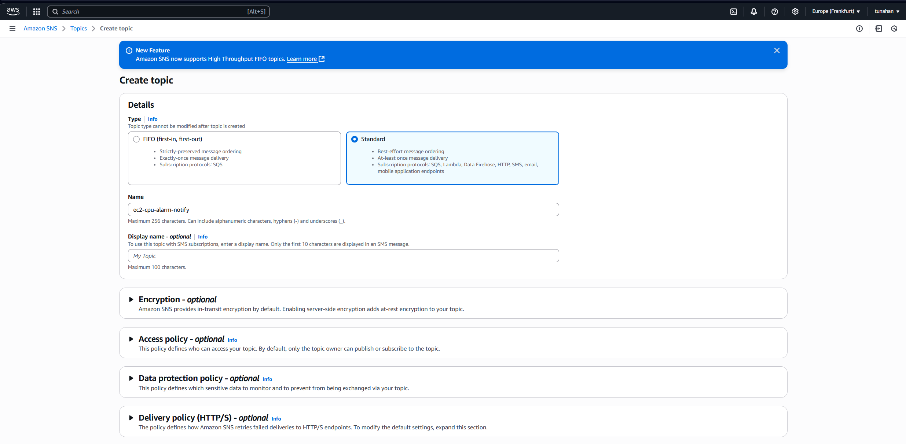
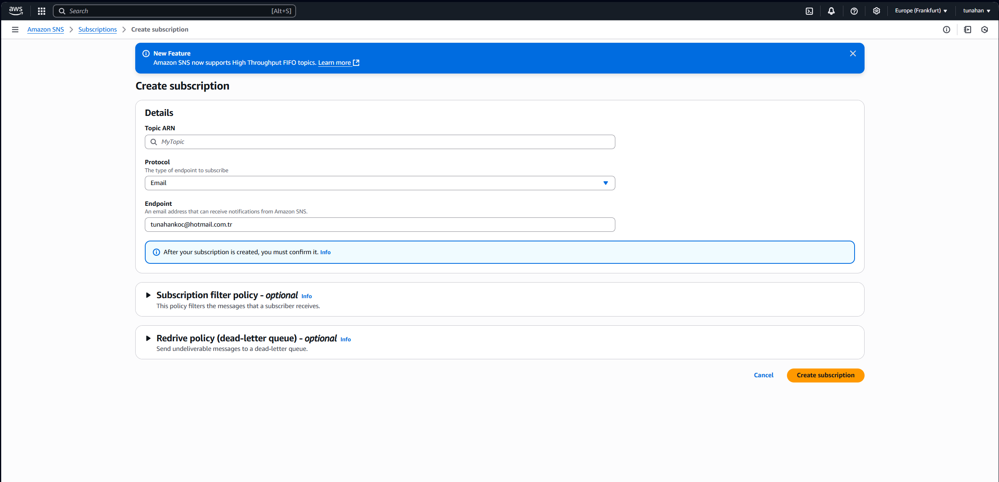
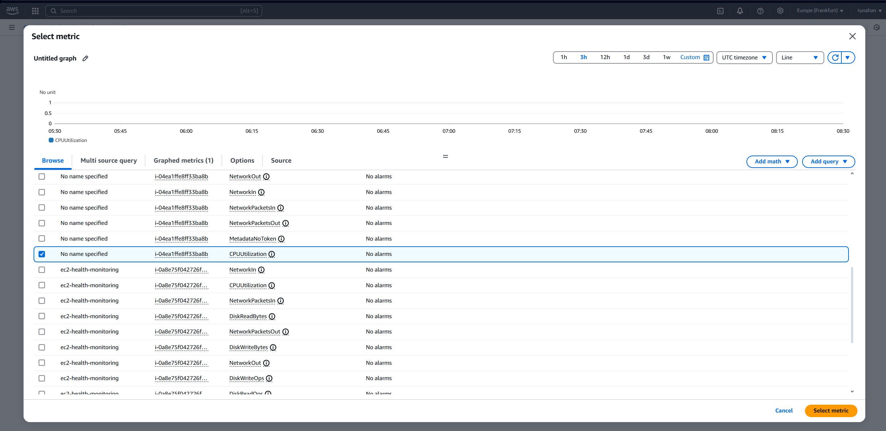
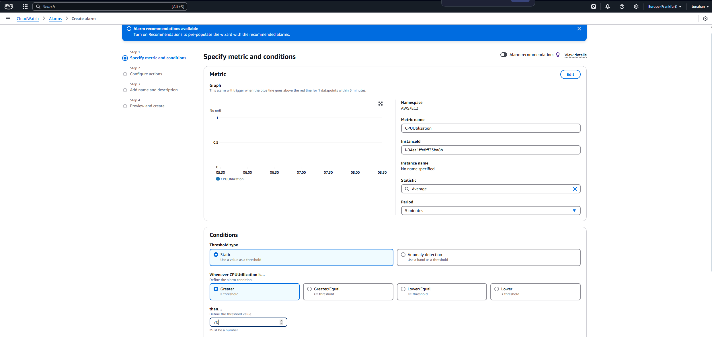
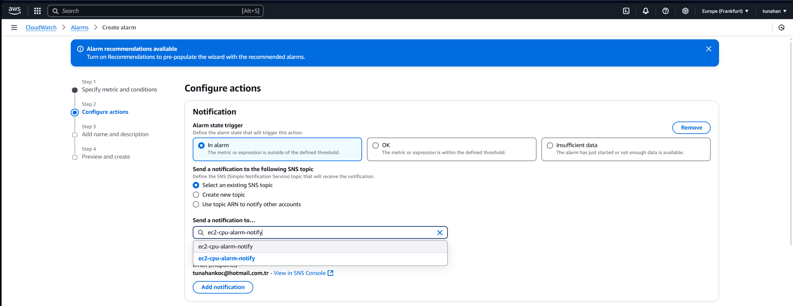
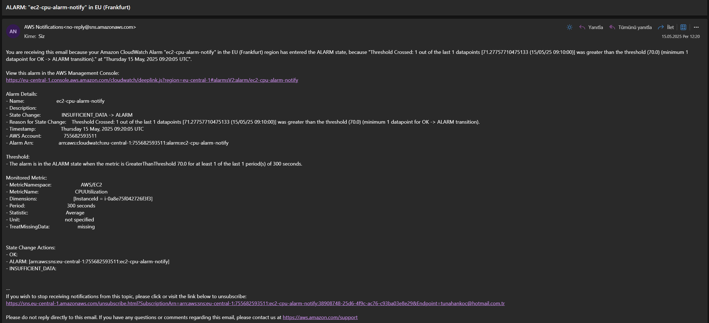

# 📊 EC2 CPU Alarm Notification via SNS

This project demonstrates how to set up an Amazon CloudWatch alarm that monitors EC2 instance CPU usage and sends a notification via Amazon SNS when the CPU usage exceeds a specified threshold.

## 🎯 Purpose

- Learn to monitor AWS EC2 instance metrics with CloudWatch
- Set up an SNS Topic to send alarm notifications via email
- Understand how to integrate SNS with CloudWatch Alarms
- Practice basic monitoring and alerting on AWS

---

## 🔧 Services Used

- **Amazon EC2** – Virtual server for running applications
- **Amazon CloudWatch** – Monitoring service for AWS resources
- **Amazon SNS (Simple Notification Service)** – Messaging service for email notification
- **IAM** – For permission and role settings

---

## 🛠️ Project Steps

### 1. Create an SNS Topic
- Go to Amazon SNS → Topics → Create topic
- Type: `Standard`
- Name: `ec2-cpu-alarm-notify`



---

### 2. Subscribe an Email to the SNS Topic
- Protocol: `Email`
- Endpoint: your email address
- Confirm the subscription from your email inbox



---

### 3. Create CloudWatch Alarm for EC2 CPU Utilization
- Go to CloudWatch → Alarms → Create Alarm
- Select metric: `EC2 → Per-Instance Metrics → CPUUtilization`
- Choose your EC2 instance



---

### 4. Define Alarm Conditions
- Condition: `Static`
- Whenever CPUUtilization is `Greater than` 70
- Period: `5 minutes`



---

### 5. Connect Alarm to SNS Topic
- On action step, select the SNS topic you created (`ec2-cpu-alarm-notify`)



---

### 6. Receive Notification on CPU Threshold Breach
When the CPU utilization crosses the threshold, an email will be sent like below:



---

## 📌 Notes

- CPUUtilization is just one of many metrics; you can use Disk I/O, Network I/O, and others similarly.
- Make sure your EC2 instance has monitoring enabled and correct IAM permissions.

## 📁 Directory Structure
```
project-root/
│
├── screenshots/
│   ├── sns-create-topic.png
│   ├── sns-subscription-create.png
│   ├── cloudwatch-alarm-select-metric.png
│   ├── cloudwatch-alarm-define-conditions.png
│   ├── cloudwatch-alarm-select-sns-topic.png
│   └── sns-alarm-notification-email.png
│
└── README.md
```

## ✅ Status

✔️ SNS Notification for EC2 Alarm successfully configured and tested.
