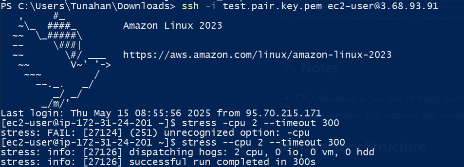

# EC2 CPU Utilization Alarm with SNS Notification

This project demonstrates how to create a CloudWatch alarm for high CPU utilization on an EC2 instance and notify via Amazon SNS.

## 🛠️ Services Used

- Amazon EC2
- Amazon CloudWatch
- Amazon SNS

## 🔧 Project Steps

### 1. Create SNS Topic and Subscription

Create a new SNS topic and subscribe with your email to receive alarm notifications.

**Screenshots:**
- 
- 
- 

### 2. Create CloudWatch Alarm

Select the EC2 instance metric (CPU Utilization) and set the conditions.

**Screenshots:**
- 
- 
- 

### 3. Simulate High CPU Load

SSH into your EC2 instance and simulate load using the `stress` tool to trigger the alarm.

**Screenshot:**
- 

## 📬 Alarm Notification

When the threshold is breached, you will receive an email from SNS.

**Screenshot:**
- 

## ✅ Result

CloudWatch successfully detects the high CPU usage and notifies the subscriber via SNS.
